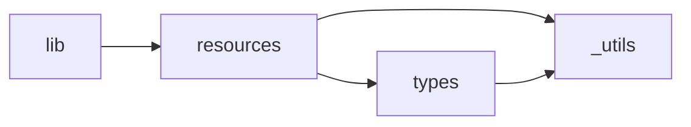

# [OMNI] origin=internal-engine domain=services/repo_architect ts=2026-04-09T10:05:44Z
# 架构分析报告: anthropic

> The official Python library for the anthropic API

**分析模式**: deep | **覆盖状态**: mixed | **模块数**: 4 | **调研**: completed

## 项目目标

This project is the official Python SDK for the Anthropic Claude API, designed to provide Python applications with a straightforward interface to interact with Claude language models. The library automatically authenticates using the ANTHROPIC_API_KEY environment variable, requires Python 3.9 or higher, and is distributed under the MIT license. Development workflows are optimized using uv for environment management, while the majority of the codebase is auto-generated, with strict boundaries preventing the generator from modifying specific extension directories.

## 高层架构

### 模块依赖图

## 模块职责

### `src/anthropic/resources`
*状态: **partial** | 读源码: 8 文件* | 识别自: `src/anthropic/resources/__init__.py`

**架构角色**: 该模块采用资源聚合与继承架构，将 Anthropic REST API 端点映射为独立的逻辑子包（completions, models, messages, beta）。核心资源类统一继承自底层 SDK 基类（SyncAPIResource/AsyncAPIResource），通过组合模式在顶层 Beta 类中动态挂载实验性子资源（models, messages, agents 等）。响应处理采用惰性代理设计，各资源类通过 @cached_property 提供 with_raw_response 和 with_streaming_response 属性，实现原始 HTTP 响应与流式响应的非侵入式拦截，整体构成典型的客户端侧控制器/网关层。

> evidence: `src/anthropic/resources/__init__.py:1-30`, `src/anthropic/resources/beta/beta.py:65-88`, `src/anthropic/resources/models.py:22`

**职责**: 模块核心职责是将 OpenAPI 规范封装为强类型 Python 方法。每个资源类负责特定业务域的请求构建、参数校验（空值检查抛 ValueError）、嵌套参数序列化（调用 maybe_transform）及 HTTP 路由委托（self._get/self._post）。同时内置分页游标处理与 Beta 版本头自动注入逻辑，提供同步/异步双链路执行模型，彻底屏蔽底层网络通信、重试与 JSON 反序列化细节，仅向调用方暴露业务模型实例。

> evidence: `src/anthropic/resources/models.py:48-78`, `src/anthropic/resources/messages/batches.py:36-58`, `src/anthropic/resources/completions.py:32-70`

**依赖**: 高度耦合于 SDK 内部基础设施链。依赖基类与客户端模块（.._resource, .._base_client 提供 HTTP 执行器与 AsyncPaginator），依赖类型工具链（.._types, .._utils, .._compat 提供 Omit, Headers, maybe_transform, path_template, cached_property），依赖外部 HTTP 客户端 httpx。业务强类型强依赖于 ..types 目录下的领域模型（如 Completion, ModelInfo, MessageBatch, BetaEnvironment）及各子模块生成的 params 结构体，所有依赖均通过相对路径导入，形成封闭式依赖环。

> evidence: `src/anthropic/resources/models.py:9-18`, `src/anthropic/resources/beta/environments.py:13-26`, `src/anthropic/resources/completions.py:8-11`

**暴露接口**: 对外暴露遵循 REST 惯例的实例方法接口集：create（生成资源）、retrieve（按 ID 查询）、list（分页列表）、update/delete（状态变更）。接口通过 Python @overload 实现多态契约，清晰界定同步解析返回与流式 Stream 返回的调用签名。批量处理（messages.batches）提供独立 CRUD 接口。Beta 接口在内部强制附加 anthropic-beta 请求头。所有公开类均通过各级 __init__.py 的 __all__ 列表严格导出，确保 API 表面整洁且 IDE 类型推断完整。

> evidence: `src/anthropic/resources/__init__.py:28-53`, `src/anthropic/resources/messages/batches.py:75-98`, `src/anthropic/resources/beta/environments.py:55-75`

**缺口**:
- responsibility: 未读入 messages/messages.py 与 completions 完整方法体，仅通过签名与部分实现推断同步/异步双链路的完整职责细节
- architecture: beta/ 下的 agents, files, skills, vaults, sessions 等子资源仅出现于 __init__.py 导出列表，其内部架构组合关系未在代码节选中展示

### `src/anthropic/types`
*状态: **partial** | 读源码: 8 文件* | 识别自: `src/anthropic/types/__init__.py`

**架构角色**: 该模块是 Anthropic SDK 的核心数据模型包, 采用“自动化生成 + 集中式扁平导出”架构。文件头部注释明确指出其由 Stainless 框架基于 OpenAPI 规范自动生成。设计上严格区分请求侧数据契约 (通常以 `*Param` 命名, 基于 `TypedDict`) 与响应/事件侧数据载体 (基于 Pydantic `BaseModel`), 并通过 `__init__.py` 统一 re-export, 形成与网络请求层解耦的静态类型层, 便于上层 SDK 客户端进行编译期检查与数据映射。

> evidence: `src/anthropic/types/__init__.py:1-2`, `src/anthropic/types/__init__.py:3-160`

**职责**: 主要负责定义与 API 交互的强类型结构与数据校验规则。具体职责包括: 1) 声明请求参数模型, 利用 `Required`、`Literal` 和 `Annotated` 约束入参格式与必填项; 2) 定义服务端响应与流式事件模型, 明确字段类型与嵌套关系; 3) 集成元数据注解 (如 `PropertyInfo` 标注 base64 格式), 并通过 `set_pydantic_config` 配置运行时兼容性, 确保类型系统在序列化/反序列化阶段的表现; 4) 聚合 Beta 特性枚举以支持 API 灰度与版本控制。

> evidence: `src/anthropic/types/base64_image_source_param.py:14-20`, `src/anthropic/types/bash_code_execution_result_block.py:12-16`, `src/anthropic/types/anthropic_beta_param.py:9-28`

**依赖**: 模块依赖 Python 标准库的 `typing` 与 `typing_extensions` 提供基础泛型支持。显式依赖 SDK 内部基础设施包: 从 `.._types` 导入基础输入类型 (如 `Base64FileInput`), 从 `.._utils` 导入属性注解工具 (`PropertyInfo`), 从 `.._models` 导入 Pydantic 模型基类 (`BaseModel`) 与配置辅助函数 (`set_pydantic_config`)。模块内部存在明确的组合依赖, 如结果块模型直接引用同包的输出块模型, 形成类型树上的层级引用关系。

> evidence: `src/anthropic/types/base64_image_source_param.py:7-10`, `src/anthropic/types/base64_pdf_source.py:3-4`, `src/anthropic/types/bash_code_execution_result_block.py:5`, `src/anthropic/types/anthropic_beta_param.py:5-6`

**暴露接口**: 对外提供高度统一的扁平化公共类型接口。调用方可直接通过 `from anthropic.types import X` 访问数百个数据模型。接口形态主要分为两类: 继承自 `TypedDict` 的参数字典接口 (提供静态类型提示与 IDE 自动补全), 以及继承自 Pydantic `BaseModel` 的实体解析接口 (提供属性访问与数据验证)。所有公开接口均通过 `__all__` 变量进行白名单控制, 确保导出边界的清晰性。

> evidence: `src/anthropic/types/__init__.py:3-160`, `src/anthropic/types/base64_image_source_param.py:10-11`, `src/anthropic/types/base64_pdf_source.py:5-6`

**缺口**:
- dependencies: 仅基于 8 个抽样文件推断依赖关系, 未遍历剩余 628 个模块文件, 无法确认是否存在对 Pydantic v2 高级特性插件、自定义类型适配器或网络请求上下文对象的隐式依赖。
- interfaces: 仅观察到纯数据结构的定义与字段导出, 未发现 `@field_validator`、`@model_validator` 或 `@property` 等动态接口行为, 接口契约的运行时转换逻辑边界不清晰。
- architecture: 架构推断高度依赖 `__init__.py` 头部注释与少量样本, 缺乏对 codegen 构建脚本、父级模块路由分发机制以及全量类型树生成策略的交叉验证。

### `src/anthropic/lib`
*状态: **complete** | 读源码: 8 文件* | 识别自: `src/anthropic/lib/__init__.py`

**架构角色**: 该模块作为 Anthropic 官方 SDK 的扩展与平台适配层，采用核心继承加子包聚合的架构模式。主目录下通过 foundry.py 定义专有客户端类，利用多重继承融合 BaseFoundryClient 与主客户端 Anthropic，实现特定云环境的定制化路由。子目录（aws、bedrock、streaming、tools）统一采用 __init__.py 显式导出模式，将底层实现细节隐藏，对外暴露扁平化的公共命名空间。模块内部以下划线前缀文件隔离私有工具逻辑，形成清晰的公共接口与内部实现的边界划分。

> evidence: `src/anthropic/lib/foundry.py:56-58`, `src/anthropic/lib/aws/__init__.py:1`, `src/anthropic/lib/_files.py:1-15`

**职责**: 核心职责涵盖多环境客户端适配、辅助文件处理、SDK 遥测追踪与高级抽象聚合。具体包括：为 Foundry 等环境提供专用客户端实例化，处理环境变量回退与参数互斥校验，并重写屏蔽不支持的端点；提供同步与异步目录遍历函数，将文件系统内容打包为 API 所需的路径与字节元组；维护调用链路追踪，通过动态标记收集工具与消息来源，自动生成专用 HTTP 请求头；统一整合流式事件类型、流管理器及 Beta 工具运行器，降低上层业务集成成本。

> evidence: `src/anthropic/lib/foundry.py:80-100`, `src/anthropic/lib/_files.py:7-18`, `src/anthropic/lib/_stainless_helpers.py:55-65`

**依赖**: 模块深度耦合 SDK 核心内部组件与标准及第三方库。内部依赖通过相对路径引入 _types（类型定义）、_client（主客户端基类）、_base_client、_models、_streaming 及多个 resources 子模块，复用现有请求构造与资源管理逻辑。外部依赖涵盖 Python 标准库（os、pathlib、functools、inspect、typing）、异步运行时支持库 anyio、HTTP 基础客户端 httpx，以及类型扩展库 typing_extensions，共同支撑同步与异步调用链路与严格的类型提示体系。

> evidence: `src/anthropic/lib/foundry.py:7-22`, `src/anthropic/lib/_files.py:4-6`, `src/anthropic/lib/streaming/__init__.py:1-2`

**暴露接口**: 对外暴露三大类接口：其一为客户端工厂接口，AnthropicFoundry 等类提供 api_key、base_url、resource、azure_ad_token_provider 等构造参数，并暴露 copy 实例方法用于配置克隆；其二为实用工具函数接口，files_from_dir 与 async_files_from_dir 处理文件批量读取，stainless_helper_header 接收 tools 与 messages 生成追踪头字典；其三为流控制与工具门面接口，通过 streaming 和 tools 子包导出 MessageStreamManager、TextEvent、BetaToolRunner、beta_tool 等高级对象，并包含向后兼容的类型别名。

> evidence: `src/anthropic/lib/foundry.py:62-75`, `src/anthropic/lib/_files.py:7`, `src/anthropic/lib/streaming/__init__.py:4-26`

### `src/anthropic/_utils`
*状态: **complete** | 读源码: 8 文件* | 识别自: `src/anthropic/_utils/__init__.py`

**架构角色**: 该模块采用典型的“聚合门面（Facade）+ 垂直拆分”内部架构。通过 `__init__.py` 作为中央枢纽，将按功能解耦的多个私有子模块（如 `_path`, `_proxy`, `_datetime_parse`, `_json`, `_compat` 等）集中导入并重导出（re-export）。这种扁平化设计既保证了各工具函数的低耦合与独立演进，又为 SDK 其他上层组件提供了统一、无嵌套的内部访问入口，符合大型 Python 库对工具包的标准组织范式。

> evidence: `src/anthropic/_utils/__init__.py:2-86`

**职责**: 承担 SDK 运行时的基础设施级辅助职责。具体涵盖：RFC 3986 标准的 URI 路径模板插值与安全百分号编码；跨 Python 版本的类型内省与注解兼容（处理 Union, Literal 等）；ISO 8601 与 Unix 时间戳的容错解析；扩展标准 JSON 编码器以支持 pydantic.BaseModel 与 datetime 序列化；系统代理环境变量到客户端挂载配置的映射；基于 `__get_proxied__` 的延迟实例化代理模式；以及根据环境变量动态配置 SDK 与底层 HTTP 客户端日志等级的能力。

> evidence: `src/anthropic/_utils/_datetime_parse.py:68-120`, `src/anthropic/_utils/_json.py:13-29`, `src/anthropic/_utils/_httpx.py:33-62`

**依赖**: 依赖 Python 标准库（re, json, urllib, logging, sys, typing 等）及第三方库 typing_extensions（用于跨版本类型特性）和 pydantic（用于模型字段提取）。内部依赖父级目录的 `.._types` 模块（引入 `StrBytesIntFloat` 类型及 `model_dump` 函数），与核心类型层存在耦合。值得注意的是，`_httpx.py` 虽用于 HTTP 代理适配，但并未直接 import httpx，仅依赖 urllib.request.getproxies 读取环境，体现了对具体 HTTP 客户端实现的运行时解耦设计。

> evidence: `src/anthropic/_utils/_json.py:7, 18`, `src/anthropic/_utils/_compat.py:4-5, 9-10`

**暴露接口**: 对外（即对 anthropic 包内其他模块）暴露扁平化的函数与类型命名空间。核心接口包含：路径操作 `path_template`；数据校验 `is_dict`, `coerce_float`, `strip_not_given`；类型内省 `get_args`, `is_union_type`, `PropertyInfo`；转换流水线 `transform`/`async_transform` 及其变体；流消费器 `consume_sync_iterator`/`consume_async_iterator`；反射工具 `function_has_argument`；时间解析 `parse_date`/`parse_datetime`；以及延迟代理抽象基类 `LazyProxy`。所有接口均通过 `__init__.py` 统一挂载，调用方仅需执行 from anthropic._utils import <name> 即可引入。

> evidence: `src/anthropic/_utils/__init__.py:2-86`

## 依赖与集成

**模块引用关系**:

- `src/anthropic/resources` → `src/anthropic/types`, `src/anthropic/_utils`
- `src/anthropic/types` → `src/anthropic/_utils`
- `src/anthropic/lib` → `src/anthropic/resources`

## 覆盖率缺口

**整体状态**: mixed

共 5 条缺口:

- `src/anthropic/resources`: responsibility: 未读入 messages/messages.py 与 completions 完整方法体，仅通过签名与部分实现推断同步/异步双链路的完整职责细节
- `src/anthropic/resources`: architecture: beta/ 下的 agents, files, skills, vaults, sessions 等子资源仅出现于 __init__.py 导出列表，其内部架构组合关系未在代码节选中展示
- `src/anthropic/types`: dependencies: 仅基于 8 个抽样文件推断依赖关系, 未遍历剩余 628 个模块文件, 无法确认是否存在对 Pydantic v2 高级特性插件、自定义类型适配器或网络请求上下文对象的隐式依赖。
- `src/anthropic/types`: interfaces: 仅观察到纯数据结构的定义与字段导出, 未发现 `@field_validator`、`@model_validator` 或 `@property` 等动态接口行为, 接口契约的运行时转换逻辑边界不清晰。
- `src/anthropic/types`: architecture: 架构推断高度依赖 `__init__.py` 头部注释与少量样本, 缺乏对 codegen 构建脚本、父级模块路由分发机制以及全量类型树生成策略的交叉验证。

## 仓库自述调研要点

- 项目名称为 anthropic，描述为 Anthropic API 的官方 Python 库  
  *— source: `pyproject.toml: name / description`*
- 当前版本号为 0.92.0  
  *— source: `pyproject.toml: version / CHANGELOG.md: 0.92.0`*
- 要求 Python 3.9 及以上版本  
  *— source: `pyproject.toml: requires-python`*
- 采用 MIT 许可证  
  *— source: `README.md: License`*
- 核心依赖包含 httpx, pydantic, typing-extensions, anyio, distro, sniffio, jiter, docstring-parser  
  *— source: `pyproject.toml: dependencies`*
- 提供 aiohttp, vertex, aws, bedrock, mcp 等可选依赖分组  
  *— source: `pyproject.toml: [project.optional-dependencies]`*
- 开发环境推荐使用 uv 管理依赖，支持通过 ./scripts/bootstrap 或 uv sync --all-extras 初始化  
  *— source: `CONTRIBUTING.md: Setting up the environment`*
- SDK 大部分代码由生成器产出，手动修改建议保留在 src/anthropic/lib/ 目录以避免合并冲突  
  *— source: `CONTRIBUTING.md: Modifying/Adding code`*
- v0.92.0 新增对 Claude Managed Agents 的 API 支持  
  *— source: `CHANGELOG.md: 0.92.0 Features`*
- v0.91.0 新增创建 Bedrock Mantle client 功能  
  *— source: `CHANGELOG.md: 0.91.0 Features`*
- v0.90.0 新增对 claude-mythos-preview 的支持，并修复合并用户参数时硬编码查询参数丢失的问题  
  *— source: `CHANGELOG.md: 0.90.0 Features & Bug Fixes`*
- 通过 pip install anthropic 安装，客户端默认从 ANTHROPIC_API_KEY 环境变量读取密钥  
  *— source: `README.md: Installation / Getting started`*

本项目是 Anthropic 官方提供的 Python 语言 SDK（名称为 anthropic），用于在 Python 应用中访问 Claude API。当前版本为 0.92.0，采用 MIT 许可证，要求 Python 3.9+ 运行环境。核心依赖包括 httpx、pydantic、anyio 等，并提供 aiohttp、vertex、aws、bedrock、mcp 等可选依赖。开发流程推荐使用 uv 工具进行环境配置与依赖同步，且 SDK 主体代码为自动生成。近期更新主要涵盖 Claude Managed Agents 支持、Bedrock Mantle 客户端创建、claude-mythos-preview 模型接入以及 Vertex 多区域端点适配。

## 设计决策 (来自文档)

- Requires Python version 3.9 or higher  
  *— source: `README.md: Requirements section`*
- Distributed under the MIT License  
  *— source: `README.md: License section`*
- Client authentication defaults to the ANTHROPIC_API_KEY environment variable without requiring explicit parameter passing  
  *— source: `README.md: Getting started code example`*
- Uses uv as the primary tool for dependency management and Python environment provisioning  
  *— source: `CONTRIBUTING.md: With uv section`*
- Supports standard pip installation via requirements-dev.lock as an alternative to uv  
  *— source: `CONTRIBUTING.md: Without uv section`*
- Most of the SDK source code is auto-generated rather than manually written  
  *— source: `CONTRIBUTING.md: Modifying/Adding code section`*
- The code generator explicitly excludes the src/anthropic/lib/ directory from modification  
  *— source: `CONTRIBUTING.md: Modifying/Adding code section`*

---

*本报告由 Omnicompany `repo-architect` 管线自动生成。*
*canonical_name=anthropic, evidence=['pyproject.toml', 'README.md', '.git/config']*