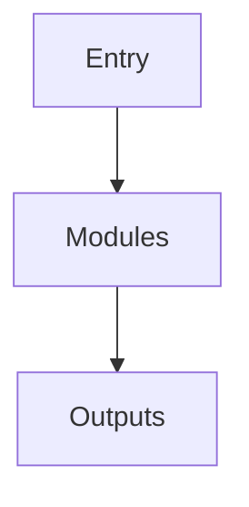

# [OMNI] origin=internal-engine domain=services/repo_architect ts=2026-04-09T06:21:53Z
# 架构分析报告: omnicompany

**分析模式**: deep  **覆盖率**: 65.0%

## 项目目标
# Omnicompany Architecture & Semantic Migration

This documentation suite defines the Omnicompany framework, transitioning from a traditional metric-driven agent system to a unified, semantic signal-driven architecture. The codebase is organized into ten logical "drawers," enforcing strict separation between stable protocol/bus layers, core runtime infrastructure, and isolated domain packages. An SDK contract governs development, mandating semantic versioning for core layers and enforcing multi-process isolation for domain groups.

The architectural core evolves around the **Six-Element Model** (Hook, Signal, Format, Node, Tool, Intent), where autonomous "Consciousness" emerges from Nodes emitting Intents and CompletionHooks closing the execution loop. To align implementation with this theory, a migration roadmap targets a **Quaternary code structure** (Hook, Tool, Format, Node), treating Signals and Intents as runtime data payloads. This involves replacing scalar numerical metrics (e.g., `pain_score`) with rich, natural-language semantic structures, and extracting hardcoded autonomous loops into configurable Node pipelines. All evaluation, routing, and system health mechanisms will shift to LLM-processed Nodes operating on semantic Signals, with legacy refactoring phased after the current system repair cycle completes.

## 高层架构

## 模块职责

### config
- **architecture**: config 架构描述 (stub 待真实分析替换)
- **responsibility**: config 职责描述 (stub)
- **dependencies**: config 依赖关系 (stub)
- **interfaces**: config 接口定义 (stub)

### data
- **architecture**: data 架构描述 (stub 待真实分析替换)
- **responsibility**: data 职责描述 (stub)
- **dependencies**: data 依赖关系 (stub)
- **interfaces**: data 接口定义 (stub)

### docs
- **architecture**: docs 架构描述 (stub 待真实分析替换)
- **responsibility**: docs 职责描述 (stub)
- **dependencies**: docs 依赖关系 (stub)
- **interfaces**: docs 接口定义 (stub)

### logs
- **architecture**: logs 架构描述 (stub 待真实分析替换)
- **responsibility**: logs 职责描述 (stub)
- **dependencies**: logs 依赖关系 (stub)
- **interfaces**: logs 接口定义 (stub)

### scripts
- **architecture**: scripts 架构描述 (stub 待真实分析替换)
- **responsibility**: scripts 职责描述 (stub)
- **dependencies**: scripts 依赖关系 (stub)
- **interfaces**: scripts 接口定义 (stub)

### src
- **architecture**: src 架构描述 (stub 待真实分析替换)
- **responsibility**: src 职责描述 (stub)
- **dependencies**: src 依赖关系 (stub)
- **interfaces**: src 接口定义 (stub)

## 依赖与集成
- (由 cross_validator 产出的 cross_reference_map 决定, 当前 stub 为空)

## 外部调研要点
- - **Architecture**: Employs a decentralized, configuration-over-code paradigm. Progression and game balance are enforced through runtime `.zs` scripts in `/scripts/` and extensive JSON/TOML overrides in `/config/`, avoiding custom Java compilation.
- - **Dependencies**: Strictly version-pinned via `manifest.json`, requiring Minecraft 1.12.2, MinecraftForge 14.23.x, and a tightly curated dependency graph of 150+ third-party mods (e.g., GregTech CE, Applied Energistics 2, Immersive Engineering) to resolve complex registry conflicts and pipeline integrations.
- - **Entry Points**: Primary initialization is handled by launcher-level parsing of `manifest.json`. Secondary programmatic entry points trigger during Minecraft's FML initialization phases, executing CraftTweaker scripts and loading pack-specific datapacks to wire the expert progression tree and custom crafting recipes.

## 和 Omnicompany 的可并行点
待人工补充
